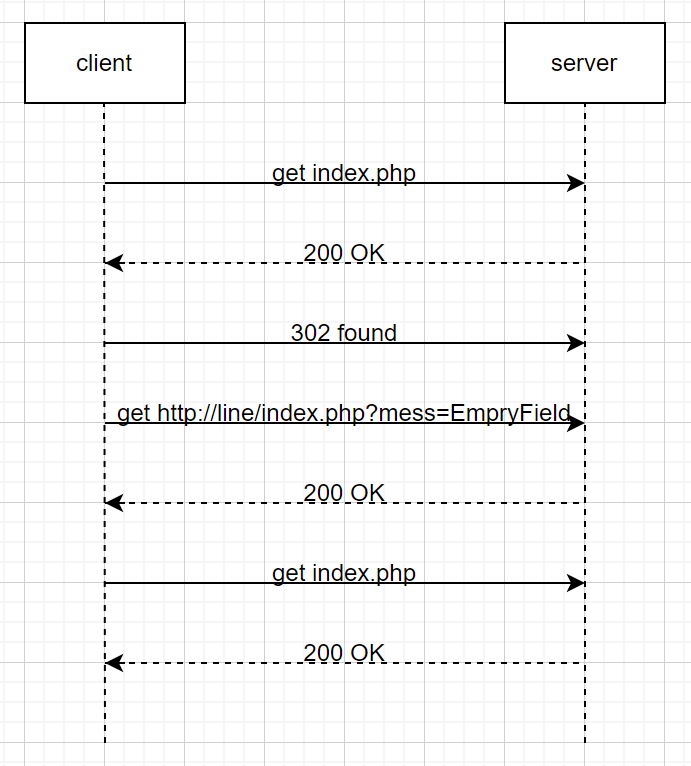
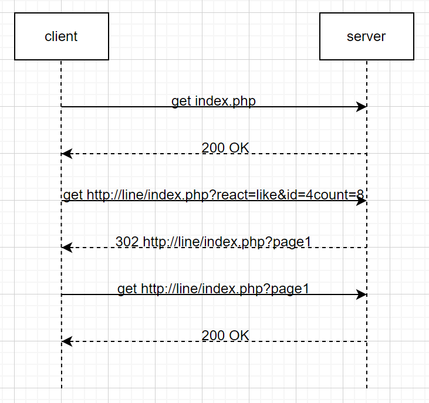
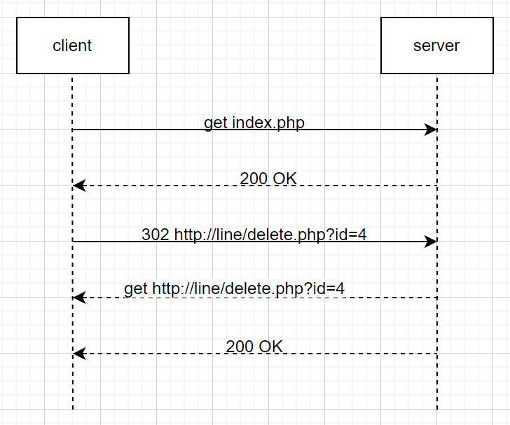
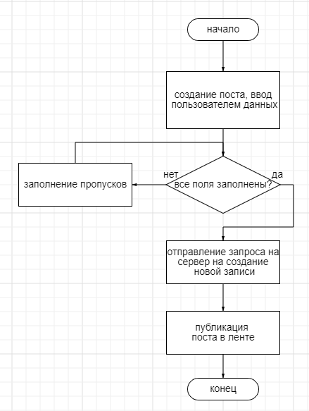
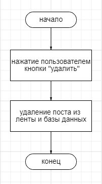
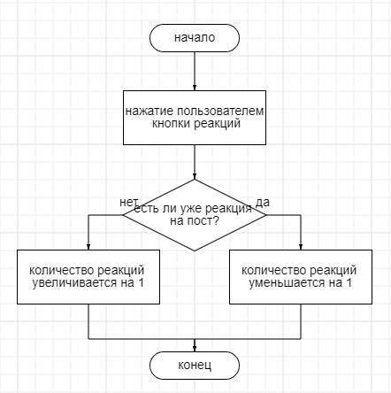

Форум
========================
Задание
------------------------
Разработать и реализовать клиент-серверную информационную систему, реализующую механизм CRUD.

Ход работы
------------------------

- Спроектировать пользовательский интерфейс
- Описать пользовательские сценарии работы
- Описать API сервера и хореографию
- Описать структуру БД и алгоритмы обработки данных
- Написать программный код
- Удостовериться в корреектности кода

#### 1. Пользовательский сценарий работы
Вначале пользователь попадает на главную страницу "index.php"" и вводит свой никнейм и текст поста, по желанию еще и изображение. При корректности ввода данных, его сообщение появится в ленте в начале списка.
Чтобы изменить содержание записи, нужно нажать на кнопку *ИЗМЕНИТЬ*, при нажатии на которую пользователь переходит на "update.php", где вносит паравки.  
Чтобы удалить запись, необходимо нажать на кнопку *УДАЛИТЬ*.
Пользователи могут ставить реакции на пост (лайки).

#### 2. API сервера и хореография
  



 


#### 3. Структура базы данных

 Таблица *post*
| Название | Тип | Длина | NULL | Описание |
| :------: | :------: | :------: | :------: | :------: |
| **id** | INT  |  |  | Автоматический идентификатор поста |
| **login** | VARCHAR | 100 | NO | Логин пользователя |
| **text** | TEXT |  |  | Текст поста |
| **time** | VARCHAR | 255 |  | Дата создания поста |
| **likes** | INT | 11 | 0 | Количество лайков |
| **image** | VARCHAR | 500 |  | Содержание картинки |

Таблица *reactionpost*
| Название | Тип | Длина | NULL | Описание |
| :------: | :------: | :------: | :------: | :------: |
| **id** | INT  |  |  | Автоматический идентификатор лайка |
| **postid** | INT |  |  | ID поста |

#### 4. Алгоритм
**Добавление записи**  
  

**Удаление записи**  
  

**Обновление записи**  
  

**Реакция на запись**  



#### 5. HTTP запрос/ответ
**Запрос**  
POST /OP2/post.php HTTP/1.1
Host: localhost
Accept: text/html,application/xhtml+xml,application/xml;q=0.9,image/avif,image/webp,image/apng,*/*;q=0.8,application/signed-exchange;v=b3;q=0.9
Content-Type: multipart/form-data; boundary=----WebKitFormBoundary3gZHpSAom751DpoA
sec-ch-ua: "Opera GX";v="93", "Not/A)Brand";v="8", "Chromium";v="107"
sec-ch-ua-mobile: ?0
sec-ch-ua-platform: "Windows"
Sec-Fetch-Dest: document
Sec-Fetch-Mode: navigate
Sec-Fetch-Site: same-origin
Sec-Fetch-User: ?1
Upgrade-Insecure-Requests: 1
User-Agent: Mozilla/5.0 (Windows NT 10.0; Win64; x64) AppleWebKit/537.36 (KHTML, like Gecko) Chrome/107.0.0.0 Safari/537.36 OPR/93.0.0.0

HTTP/1.1 302 Found
Cache-Control: no-store, no-cache, must-revalidate
Connection: Keep-Alive
Content-Length: 40
Content-Type: text/html; charset=UTF-8
Date: Fri, 23 Dec 2022 21:19:48 GMT
Expires: Thu, 19 Nov 1981 08:52:00 GMT
Keep-Alive: timeout=5, max=100
Location: index.php
Pragma: no-cache
Server: Apache/2.4.54 (Win64) PHP/8.1.11
X-Powered-By: PHP/8.1.11

**Ответ**
GET /OP2/index.php HTTP/1.1
Host: localhost
Accept: text/html,application/xhtml+xml,application/xml;q=0.9,image/avif,image/webp,image/apng,*/*;q=0.8,application/signed-exchange;v=b3;q=0.9
sec-ch-ua: "Opera GX";v="93", "Not/A)Brand";v="8", "Chromium";v="107"
sec-ch-ua-mobile: ?0
sec-ch-ua-platform: "Windows"
Sec-Fetch-Dest: document
Sec-Fetch-Mode: navigate
Sec-Fetch-Site: same-origin
Sec-Fetch-User: ?1
Upgrade-Insecure-Requests: 1
User-Agent: Mozilla/5.0 (Windows NT 10.0; Win64; x64) AppleWebKit/537.36 (KHTML, like Gecko) Chrome/107.0.0.0 Safari/537.36 OPR/93.0.0.0

HTTP/1.1 200 OK
Connection: Keep-Alive
Content-Type: text/html; charset=UTF-8
Date: Fri, 23 Dec 2022 21:19:48 GMT
Keep-Alive: timeout=5, max=99
Server: Apache/2.4.54 (Win64) PHP/8.1.11
Transfer-Encoding: chunked
X-Powered-By: PHP/8.1.11

#### 6. Значимые фрагменты кода

**Пагинация**
```php
$post = mysqli_query($connect, "SELECT * FROM post ORDER BY id DESC");
$posts = mysqli_fetch_all($post);
$total = count($posts); // кол-во постов
$per_page = 5; // кол-во постов на одну страницу
$count_page = ceil( $total / $per_page ); // кол-во страниц
$page = $_GET['page']??1; // определение страницы по GET запросу
$page = (int)$page;
if(!$page || $page < 1){
    $page = 1;
} else if ($page > $count_page) {
    $page = $count_page;
}
$start = ($page - 1) * $per_page; // начало распечатки элементов постранично
```

**Увеличение счётчика лайка**
```php
if (isset($_POST['liked'])) {
	$post_id = $_POST['postid'];
	$result = mysqli_query($connect, "SELECT * FROM post WHERE id = $post_id");
	$row = mysqli_fetch_array($result);
	$like = $row['likes'];
    if ($like < 0){
        $like = 0;
    }
	mysqli_query($connect, "INSERT INTO likes (postid) VALUES ($post_id)");
	mysqli_query($connect, "UPDATE post SET likes = $like + 1 WHERE id = $post_id");
	echo $like + 1;
	exit();
}
```

**Отправка данных нового поста**
```php
session_start();
require_once 'connect.php';

$post = $_POST['post'];
$login = $_POST['login'];
$date = date(" H : i : s d - m - Y ");
$path = 'uploads/'. time(). $_FILES['img']['name'];

move_uploaded_file($_FILES['img']['tmp_name'], $path);
if(!move_uploaded_file($_FILES['img']['tmp_name'], $path)){
    echo "Ошибка загрузки файла";
}

mysqli_query($connect, "INSERT INTO `post`(`id`, `login`, `text`, `time`, `image`)
            VALUES(NULL, '$login', '".addslashes($post)."', '$date', '$path')");
header('Location:../index.php');
```
Вывод
------------------------
Во время выполнения лабораторной работы была спроектирована и разработана система клиент-сервер, реализующая механизм CRUD. Создан сайт с реализацией базовых возможностей взаимодействия со страницей.
